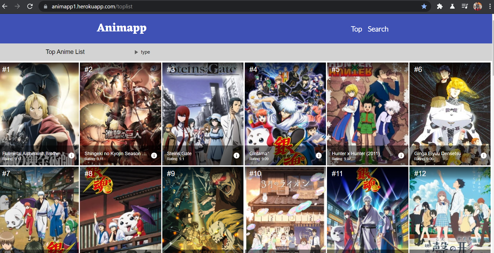

# Animapp
- #### An informative anime website.
- #### Used
    - ##### [ReactJs ](https://reactjs.org/)
    - ##### [Axios](https://www.npmjs.com/package/axios)
    -  ##### [Jikan Apiary](https://jikan.docs.apiary.io/#)
    -  ##### [Material-ui](https://material-ui.com/)

## Pages

       

## Link of the website
- #### [Animapp](https://animapp1.herokuapp.com/)

## Issue
- Because of the size of package it takes some time to load the website.
<!--- 
- if you see this error please try refreshing the page

-->
